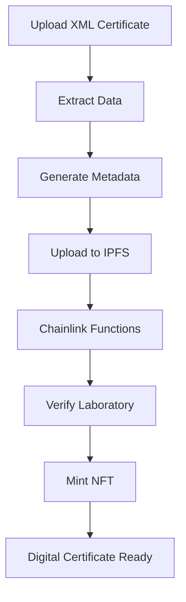

# 🎯 CaliBra - Digital Calibration Certificates

> **Hackathon Chainlink 2025** - Transforming Traditional Calibration Certificates into Secure Blockchain-Based NFTs

## 🌟 Overview

CaliBra is a revolutionary platform that converts traditional XML calibration certificates into secure, immutable digital certificates stored on the Avalanche blockchain. Built specifically for the **Chainlink Hackathon 2025**, this project demonstrates the power of decentralized oracles for real-world applications in metrology and certification.

### 🔥 Key Features

- **🔒 Blockchain Security**: Immutable certificate storage on Avalanche
- **🌐 IPFS Integration**: Decentralized file storage via Pinata
- **🔗 Chainlink Functions**: Automated laboratory credential verification
- **📄 DCC Support**: Digital Calibration Certificate (DCC) standard compliance
- **✨ NFT Generation**: Certificates as verifiable NFTs with metadata
- **🏔️ Avalanche Network**: Fast, low-cost transactions
- **📱 Modern UI**: Responsive React interface with Tailwind CSS

## 🎯 Hackathon Context

This project was developed for the **Chainlink Hackathon 2025** to showcase:

1. **Chainlink Functions** for off-chain computation and data verification
2. **Real-world utility** in metrology and calibration industry
3. **Web3 integration** with traditional industrial processes
4. **Decentralized storage** solutions for sensitive documents

## 🚀 How It Works



### 📋 Process Flow

1. **📤 Upload**: User uploads XML calibration certificate
2. **🔍 Parse**: System extracts certificate data (lab, instrument, dates)
3. **📝 Generate**: Creates NFT metadata with certificate information
4. **☁️ IPFS**: Uploads files and metadata to decentralized storage
5. **🔗 Chainlink**: Functions verify laboratory credentials
6. **⛓️ Blockchain**: Mints NFT on Avalanche with verified data
7. **✅ Complete**: User receives permanent digital certificate

## 🛠️ Technology Stack

### Frontend
- **Next.js 15** - React framework
- **TypeScript** - Type safety
- **Tailwind CSS** - Styling
- **Wagmi & RainbowKit** - Web3 integration
- **Ethers.js** - Blockchain interaction

### Backend/APIs
- **Next.js API Routes** - Server functions
- **Pinata SDK** - IPFS integration
- **Formidable** - File upload handling
- **XML2JS** - XML parsing

### Blockchain
- **Avalanche C-Chain** - Main network
- **Avalanche Fuji** - Testnet
- **Chainlink Functions** - Oracle services
- **Solidity Smart Contracts** - Certificate registry

## 📦 Installation

### Prerequisites

- Node.js 18+ 
- pnpm (recommended) or npm
- MetaMask or compatible Web3 wallet
- Pinata account (for IPFS)

### 1. Clone Repository

```bash
git clone https://github.com/your-username/calibra-client.git
cd calibra-client
```

### 2. Install Dependencies

```bash
# Using pnpm (recommended)
pnpm install

# Or using npm
npm install
```

### 3. Environment Setup

Create `.env.local` file:

```env
# WalletConnect Project ID
NEXT_PUBLIC_WALLETCONNECT_PROJECT_ID=your_walletconnect_project_id

# App Configuration
NEXT_PUBLIC_APP_NAME="Calibra - Digital Calibration Certificates"
NEXT_PUBLIC_APP_URL="http://localhost:3000"

# Pinata Configuration (for IPFS)
PINATA_JWT=your_pinata_jwt_token
NEXT_PUBLIC_GATEWAY_URL=your_pinata_gateway_url
```

### 4. Get Required Keys

#### WalletConnect Project ID
1. Go to [WalletConnect Cloud](https://cloud.walletconnect.com)
2. Create a new project
3. Copy the Project ID

#### Pinata Configuration
1. Create account at [Pinata](https://app.pinata.cloud)
2. Go to Developers → API Keys
3. Create new key with full permissions
4. Copy JWT token and gateway URL

## 🚀 Running the Application

### Development Mode

```bash
# Start development server
pnpm dev

# Or with npm
npm run dev
```

Open [http://localhost:3000](http://localhost:3000) in your browser.

### Production Build

```bash
# Build for production
pnpm build

# Start production server
pnpm start
```

## 🌐 Deployment

### Vercel (Recommended)

1. **Deploy to Vercel**:
   ```bash
   # Install Vercel CLI
   npm i -g vercel
   
   # Deploy
   vercel
   ```

2. **Set Environment Variables**:
   - Go to Vercel Dashboard → Project → Settings → Environment Variables
   - Add all variables from `.env.local`

3. **Important for Vercel**:
   - All file operations use IPFS (no local file system writes)
   - Environment variables must be set in Vercel dashboard
   - Public folder files are served statically

## 📱 Usage

### For Users

1. **Connect Wallet**: Use MetaMask or compatible wallet
2. **Switch Network**: Ensure you're on Avalanche network
3. **Download Example**: Get sample XML from the interface
4. **Upload Certificate**: Drag & drop your XML calibration certificate
5. **Add Image** (optional): Include equipment photo
6. **Process**: Wait for blockchain confirmation
7. **View NFT**: Access your digital certificate on Snowtrace

### Example Certificate

The app includes a sample DCC XML file (`dcc_example.xml`) for testing:
- **Instrument**: Keysight 34465A Digital Multimeter
- **Laboratory**: PTB Calibration Laboratory
- **Standard**: Complete DCC format compliance

## 🔧 Smart Contracts

### Avalanche Fuji Testnet
- **DCCNFT**: `0x8f139E6D41B3C87f06cB2BFd74754Dd747A40787`
- **DCCRegistry**: `0x1bBc93F287Cba4630B53c6cB32779De75865F98B`

## 🏗️ Project Structure

```
calibra-client/
├── pages/
│   ├── api/                 # Next.js API routes
│   │   ├── upload-ipfs.ts   # IPFS file upload
│   │   └── upload-metadata.ts # Metadata upload
│   └── _app.tsx             # App configuration
├── src/
│   ├── components/          # React components
│   ├── hooks/               # Custom hooks
│   ├── contracts/           # Contract interfaces
│   ├── providers/           # Context providers
│   ├── types/               # TypeScript types
│   └── utils/               # Utility functions
├── public/
│   └── dcc_example.xml      # Sample certificate
└── CaliBra/                 # Smart contracts (separate repo)
```

## 🐛 Troubleshooting

### Common Issues

1. **"EROFS: read-only file system"**:
   - This was fixed - all files now go directly to IPFS
   - No local file system writes in production

2. **Wallet Connection Issues**:
   - Ensure MetaMask is installed
   - Check network is Avalanche C-Chain
   - Verify WalletConnect Project ID

3. **IPFS Upload Failures**:
   - Check Pinata JWT token validity
   - Verify gateway URL format
   - Ensure API key has proper permissions

4. **Transaction Failures**:
   - Check AVAX balance for gas fees
   - Verify contract addresses
   - Ensure proper network selection

## 📄 License

This project is open source and available under the [MIT License](LICENSE).
